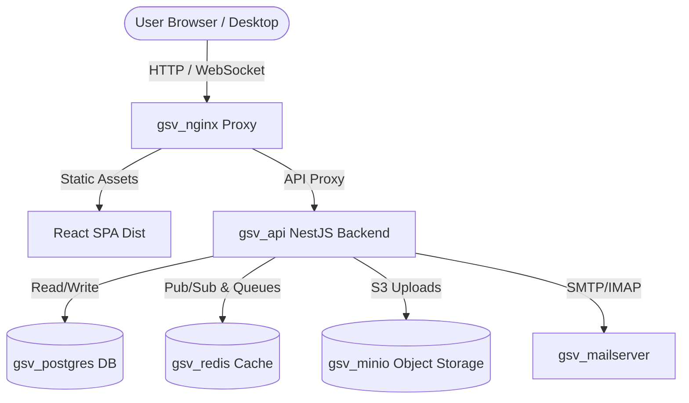

# GSV Office — System Architecture Document

This document provides a technical overview of the GSV Office platform components, data flows, network topology, and storage layout on TrueNAS SCALE.

---

## 1. System Components Architecture

GSV Office is built as a microservices architecture running via Docker Compose containers:

### Components Description:
1. **Frontend Proxy (`gsv_nginx`):** Terminate SSL/TLS connections, serve build static files for React frontend, and proxy `/api/*` and `/socket.io/*` traffic to the backend API.
2. **Backend API (`gsv_api`):** NestJS REST API and Socket.io gateway handling business logic (chat events, document indexing, invoices, ticketing workflows).
3. **Database (`gsv_postgres`):** PostgreSQL database storing relational tables (users, notes, ticket tickets, billing data, system logs).
4. **Cache & Message Broker (`gsv_redis`):** Redis instance managing background mail queues (BullMQ), socket sessions, and data caching.
5. **Object Store (`gsv_minio`):** S3-compatible local object storage storing user avatars, chat media attachments, and notes documents.
6. **Mail Server (`gsv_mailserver`):** Full-featured local SMTP/IMAP server for routing system notifications and Department mail queues.

---

## 2. Storage & ZFS Volume Layout

On TrueNAS SCALE, persistence is managed by mapping Docker Named Volumes to ZFS pools.

### Dataset Mappings:
* **ZFS Dataset Location:** `/mnt/GSVR_Movies/apps/gsv-office`
* **Volume Bindings:**
  * **Database Persistence:** `postgres_data` mapped to `/var/lib/postgresql/data` (for ZFS write efficiency, PostgreSQL write-ahead logs are kept on SSD-based ZFS pools).
  * **MinIO Objects:** `minio_data` mapped to `/data` (stores raw encrypted object blobs).
  * **File Uploads:** `uploads_data` mapped to `/var/www/uploads` (for general raw document shares).
  * **Config directories:** Direct host bind mounts for config files:
    * `/mnt/GSVR_Movies/apps/gsv-office/nginx/nginx.conf` -> `/etc/nginx/nginx.conf`
    * `/mnt/GSVR_Movies/apps/gsv-office/database/schema.sql` -> `/docker-entrypoint-initdb.d/01_schema.sql`

---

## 3. Network Topology & Ports Mapping

GSV Office isolates internal backend services from external networks using a dedicated bridge:

* **Internal Network:** `ix-gsv-office_gsv_network` (bridge, subnet `172.20.0.0/16`).
* **Exposed Ports:**
  * **Nginx HTTP:** Port `8080` mapped to host container port `80`.
  * **Nginx HTTPS:** Port `8443` mapped to host container port `443`.
  * **Mail SMTP:** Port `25` & `587` mapped directly for mail servers.
  * **Mail IMAP:** Port `143` & `993` mapped for mail clients.
* **Secured Ports (Not exposed to host):**
  * PostgreSQL (`5432`), Redis (`6379`), MinIO API (`9000`), NestJS API (`3000`) are accessible **only** inside the virtual bridge network.
